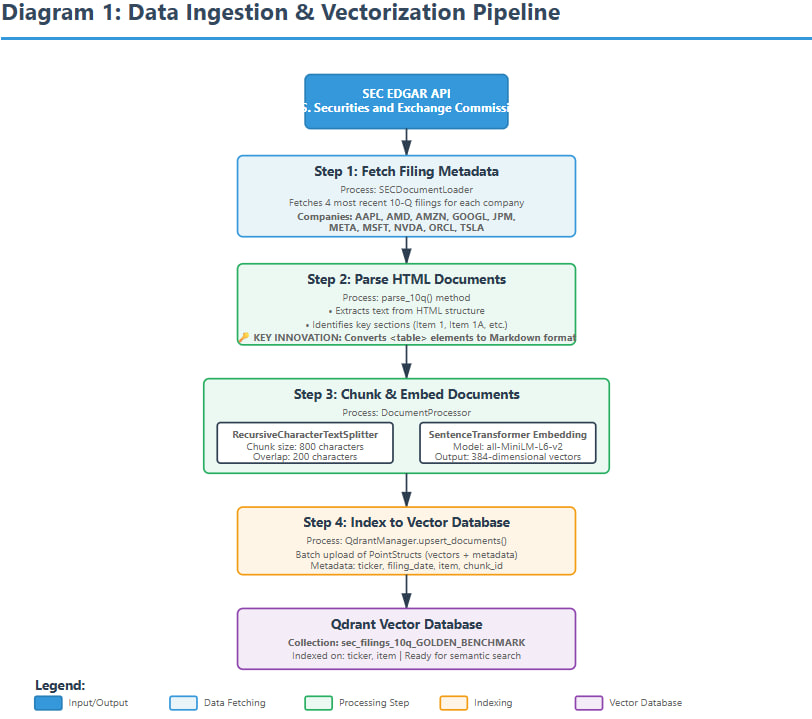
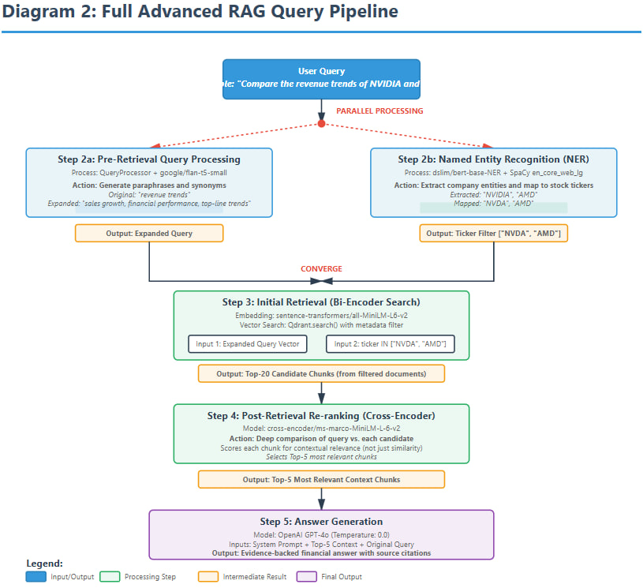

# Multi-Model NLP Approach for Retrieval, Question Answering, and Summarization of SEC 10-Q Filings

[](https://www.python.org/downloads/)
[](https://opensource.org/licenses/MIT)

A systematic evaluation of an advanced Retrieval-Augmented Generation (RAG) pipeline for answering complex financial questions using SEC 10-Q quarterly filings. This project demonstrates that sophisticated retrieval engineering, particularly NER-based filtering and cross-encoder re-ranking can improve numerical accuracy by 28% compared to naive RAG implementations.

## 📋 Table of Contents

- [Overview](#-overview)
- [Key Findings](#-key-findings)
- [Project Structure](#-project-structure)
- [Installation](#-installation)
- [Quick Start](#-quick-start)
- [System Architecture](#-system-architecture)
- [Model Architectures](#-model-architectures)
- [Evaluation Metrics](#-evaluation-metrics)
- [Results](#-results)
- [Technology Stack](#-technology-stack)
- [Contributing](#-contributing)
- [Citation](#-citation)
- [License](#-license)

## 🎯 Overview

### Motivation

Quarterly SEC 10-Q filings provide critical, time-sensitive insights into corporate performance, but their dense, unstructured format (often 100+ pages) poses significant challenges for information extraction. Manual analysis is slow and error-prone, while existing question-answering systems suffer from:

- **Cross-company contamination**: Retrieving irrelevant documents from other companies
- **Semantic-relevance mismatch**: Finding topically similar but contextually irrelevant passages
- **Numerical hallucinations**: Generating incorrect financial figures

### Our Approach

This project systematically builds and evaluates a multi-stage RAG pipeline through ablation studies, comparing:

- **Model 1**: Baseline GPT-4o (no retrieval)
- **Model 2**: Base RAG (naive vector search)
- **Model 3**: NER-based Entity Filtering
- **Model 4**: Pre-Retrieval Query Expansion
- **Model 5**: Post-Retrieval Re-ranking
- **Model 6**: Full Advanced Pipeline (combines all enhancements)

We built a custom benchmark of 125+ financial questions across 10 major companies (AAPL, AMD, AMZN, GOOGL, JPM, META, MSFT, NVDA, ORCL, TSLA) to rigorously evaluate each architecture.

## 🔑 Key Findings

| Metric | Base RAG | Full Pipeline | Change |
|--------|----------|---------------|--------|
| **Semantic Similarity** | 0.461 | 0.461 | Tie |
| **Correct Numbers** | 0.112 | **0.144** | **+28.6%** ✅ |
| **Missed Numbers** | 1.480 | **1.448** | **-2.2%** ✅ |
| **Hallucinated Numbers** | **1.672** | 1.824 | **+9.1%** ⚠️ |

### Critical Insights

1. **NER Filtering is Essential**: Eliminates cross-company contamination—the #1 failure mode of naive RAG
2. **Re-ranking Improves Precision**: CrossEncoder re-ranking surfaces more relevant, answer-bearing passages
3. **Precision-Recall Trade-off**: Advanced retrieval increases correct extraction (+28%) but also hallucination risk (+9%)
4. **Generation Safeguards Needed**: The next frontier is adding verification mechanisms to validate extracted numbers against source text

## 📁 Project Structure

```
sec-10q-rag-pipeline/
├── data/
│   ├── SEC_QnA.csv                          # Ground-truth benchmark (125+ Q&A pairs)
│   ├── evaluation_results.csv               # Quantitative comparison results
│   ├── baseline_no_RAG_results.json         # Model 1 outputs
│   ├── base_RAG_results.json                # Model 2 outputs
│   ├── RAG_NER_results.json                 # Model 3 outputs
│   ├── RAG_query_processing_results.json    # Model 4 outputs
│   ├── RAG_post_retrieval_results.json      # Model 5 outputs
│   ├── RAG_full_pipeline_results.json       # Model 6 outputs
│   └── *.png                                # Evaluation plots
├── notebooks/
│   ├── 0_build_database.ipynb               # 🔧 Build vector database
│   ├── 1_base_no_RAG.ipynb                  # Model 1: Baseline
│   ├── 2_base_RAG.ipynb                     # Model 2: Base RAG
│   ├── 3_RAG_NER.ipynb                      # Model 3: NER Filtering
│   ├── 4_RAG_query_processing.ipynb         # Model 4: Query Expansion
│   ├── 5_RAG_post_retrieval.ipynb           # Model 5: Re-ranking
│   ├── 6_RAG_full_pipeline.ipynb            # Model 6: Full Pipeline
│   └── evaluation.ipynb                     # 📊 Evaluation & Analysis
├── report/
│   └── DSA4213_Final_Report_Group_46.pdf    # Full project report (LaTeX)
├── images/
│   └── diagram1.png                         # Data ingestion and vectorization pipeline
│   └── diagram2.png                         # Full advanced RAG query pipeline
├── .gitignore
├── requirements.txt                         # Python dependencies
└── README.md                                # This file
```

## 🛠️ Installation

### Prerequisites

- Python 3.12+
- OpenAI API key
- Qdrant vector database (cloud or local)

### Setup

1. **Clone the repository**
   ```bash
   git clone https://github.com/[YOUR-USERNAME]/sec-10q-rag-pipeline.git
   cd sec-10q-rag-pipeline
   ```

2. **Create virtual environment**
   ```bash
   python3.12 -m venv .venv
   
   # On macOS/Linux
   source .venv/bin/activate
   
   # On Windows
   .venv\Scripts\activate
   ```

3. **Install dependencies**
   ```bash
   pip install -r requirements.txt
   ```

4. **Download NLP models**
   ```bash
   python -m spacy download en_core_web_lg
   ```

5. **Configure environment variables**
   
   Create a `.env` file in the project root:
   ```env
   OPENAI_API_KEY=sk-your-openai-api-key
   QDRANT_URL=https://your-cluster-url.qdrant.tech:6333
   QDRANT_API_KEY=your-qdrant-api-key
   ```

   Alternatively, you can run Qdrant locally:
   ```bash
   docker run -p 6333:6333 qdrant/qdrant
   ```

## 🚀 Quick Start

### Step 1: Build the Vector Database

Run all cells in `notebooks/0_build_database.ipynb`

This notebook will:
- Fetch the 4 most recent 10-Q filings for each of the 10 companies via SEC EDGAR API
- Parse HTML and convert tables to Markdown format
- Chunk documents (800 chars with 200 overlap)
- Embed using `sentence-transformers/all-MiniLM-L6-v2`
- Create the `sec_filings_10q_GOLDEN_BENCHMARK` collection in Qdrant

**⏱️ Expected time:** 20-30 minutes (one-time setup)

### Step 2: Run Model Pipelines

Execute notebooks 1-6 to generate prediction files:

```bash
# Model 1: Baseline (No RAG)
notebooks/1_base_no_RAG.ipynb

# Model 2: Base RAG (Control Group)
notebooks/2_base_RAG.ipynb

# Model 3: NER Filtering
notebooks/3_RAG_NER.ipynb

# Model 4: Query Expansion
notebooks/4_RAG_query_processing.ipynb

# Model 5: Post-Retrieval Re-ranking
notebooks/5_RAG_post_retrieval.ipynb

# Model 6: Full Advanced Pipeline
notebooks/6_RAG_full_pipeline.ipynb
```

Each notebook loads the benchmark questions from `data/SEC_QnA.csv` and generates a corresponding `*_results.json` file with model predictions.

### Step 3: Evaluate Results

Run all cells in `notebooks/evaluation.ipynb`

This notebook:
- Loads ground-truth answers and model predictions
- Computes semantic similarity using `sentence-transformers/all-mpnet-base-v2`
- Extracts and compares numerical values (correct, missed, hallucinated)
- Generates visualizations and saves to `data/evaluation_results.csv`

**📈 Outputs:**
- `evaluation_results.csv`: Per-question comparison metrics
- `semantic_similarity_boxplot.png`: Distribution of similarity scores
- `correct_numbers_boxplot.png`: Distribution of correct extractions
- `hallucinated_numbers_boxplot.png`: Distribution of hallucinations
- And more...

## 🏗️ System Architecture

### Data Ingestion & Vectorization Pipeline

The first pipeline transforms raw SEC filings into a queryable vector database:



**Key Steps:**
1. **Fetch Metadata**: Retrieves 10-Q filings via SEC EDGAR API
2. **Parse HTML**: Extracts text and converts tables to Markdown format
3. **Chunk & Embed**: Splits documents and creates 384-dim vectors
4. **Index**: Stores in Qdrant with metadata filters (ticker, item)

### Advanced RAG Query Pipeline

The full pipeline integrates multiple enhancement techniques for accurate retrieval:



**Pipeline Flow:**
1. **User Query**: Natural language financial question
2. **Parallel Processing**:
   - Query Expansion (Flan-T5) for broader semantic coverage
   - NER Extraction to identify company tickers
3. **Filtered Retrieval**: Vector search restricted to relevant companies (Top-20)
4. **Cross-Encoder Re-ranking**: Deep relevance scoring (Top-5)
5. **Generation**: GPT-4o produces evidence-backed answer

---

## 🏗️ Model Architectures

### Model 1: Baseline (No RAG)
```
User Query → GPT-4o (pre-trained knowledge only) → Answer
```

### Model 2: Base RAG (Control)
```
User Query → Embed → Vector Search (Top-5) → GPT-4o → Answer
```

### Model 3: NER Filtering
```
User Query → NER (Extract Ticker) → Filtered Vector Search (Top-5) 
          → GPT-4o → Answer
```

### Model 4: Pre-Retrieval Query Expansion
```
User Query → Query Expansion (Flan-T5) → Embed Expanded Query 
          → Vector Search (Top-5) → GPT-4o → Answer
```

### Model 5: Post-Retrieval Re-ranking
```
User Query → Embed → Vector Search (Top-20) 
          → CrossEncoder Re-rank → Top-5 → GPT-4o → Answer
```

### Model 6: Full Advanced Pipeline
```
User Query → Query Expansion → NER Extraction 
          → Filtered Vector Search (Top-20)
          → CrossEncoder Re-rank → Top-5 
          → GPT-4o → Answer
```

## 📊 Evaluation Metrics

### 1. Semantic Similarity

Measures linguistic and contextual alignment between generated and ground-truth answers.

```python
similarity = cosine_similarity(
    embedding_model.encode(predicted_answer),
    embedding_model.encode(ground_truth_answer)
)
```

**Model:** `sentence-transformers/all-mpnet-base-v2`

### 2. Numerical Faithfulness

Critical for financial applications—measures numeric accuracy.

```python
correct_numbers = len(predicted_numbers ∩ ground_truth_numbers)
missed_numbers = len(ground_truth_numbers - predicted_numbers)
hallucinated_numbers = len(predicted_numbers - ground_truth_numbers)
```

Extracted using regex pattern matching and validated against source documents.

## 📈 Results

### Quantitative Summary

The Full Advanced Pipeline (Model 6) achieves:
- ✅ **28% more correct numerical extractions** than Base RAG
- ✅ **2.2% fewer missed numbers**
- ⚠️ **9.1% more hallucinated numbers** (precision-recall trade-off)
- 🤝 **Identical semantic similarity** (both models stay on-topic)

### Qualitative Analysis: NER Filtering Case Study

**Question:** "How has Microsoft's operating income changed over the last year?"

**Base RAG (Failed):**
- Retrieved: Documents from AMZN, AMZN, AMZN, GOOGL, AMD
- Answer: "The provided context does not contain information about Microsoft..."

**NER-Enabled RAG (Succeeded):**
- Extracted entity: "Microsoft" → Ticker: "MSFT"
- Retrieved: Documents from MSFT, MSFT, MSFT, MSFT, MSFT
- Answer: Correctly scoped to Microsoft filings

**Impact:** NER filtering eliminates the #1 failure mode of naive RAG—cross-company contamination.

### Visualizations

See `data/` folder for:
- Semantic similarity distributions (Figure 1, 2)
- Numerical accuracy time series (Figure 3)
- Correct vs. hallucinated scatter plots (Figure 4)
- Box plots for all metrics

## 🔧 Technology Stack

| Component | Technology |
|-----------|------------|
| **LLM** | GPT-4o (OpenAI) |
| **Vector Database** | Qdrant |
| **Orchestration** | LangChain |
| **Bi-Encoder (Retrieval)** | `sentence-transformers/all-MiniLM-L6-v2` |
| **Cross-Encoder (Re-ranking)** | `cross-encoder/ms-marco-MiniLM-L-6-v2` |
| **Evaluation Embeddings** | `sentence-transformers/all-mpnet-base-v2` |
| **Query Expansion** | `google/flan-t5-small` |
| **NER** | SpaCy `en_core_web_lg` + `dslim/bert-base-NER` |
| **Data Processing** | pandas, numpy |
| **Web Scraping** | requests, BeautifulSoup4 |

## 🤝 Contributing

This is an academic project, but we welcome:
- Bug reports and fixes
- Suggestions for additional RAG components to evaluate
- Extensions to other document types (10-K, 8-K, earnings calls)

Please open an issue or submit a pull request.

## 📝 Citation

If you use this work in your research, please cite:

```bibtex
@article{
  title={Multi-Model NLP Approach for Retrieval, Question Answering, and Summarization of SEC 10-Q Filings},
  author={Cher, Calmen and Chan, Thong Fong and Ng, Zhi Min},
  journal={DSA4213 Natural Language Processing for Data Science},
  year={2025},
  institution={National University of Singapore}
}
```

## 📄 License

This project is licensed under the MIT License. See `LICENSE` file for details.

## 🙏 Acknowledgments

- **Course:** DSA4213 Natural Language Processing for Data Science, NUS
- **Instructors:** Professor Doudou Zhou
- **Data Source:** U.S. Securities and Exchange Commission (SEC EDGAR)

## 📧 Contact

For questions or collaboration opportunities:
- Calmen Cher: [calmen0797@gmail.com]
- Chan Thong Fong: [thongfong.16@gmail.com]
- Ng Zhi Min: [zhiminng03@gmail.com]

---

**Note:** This project is for educational purposes. Always verify financial information from official sources before making investment decisions.